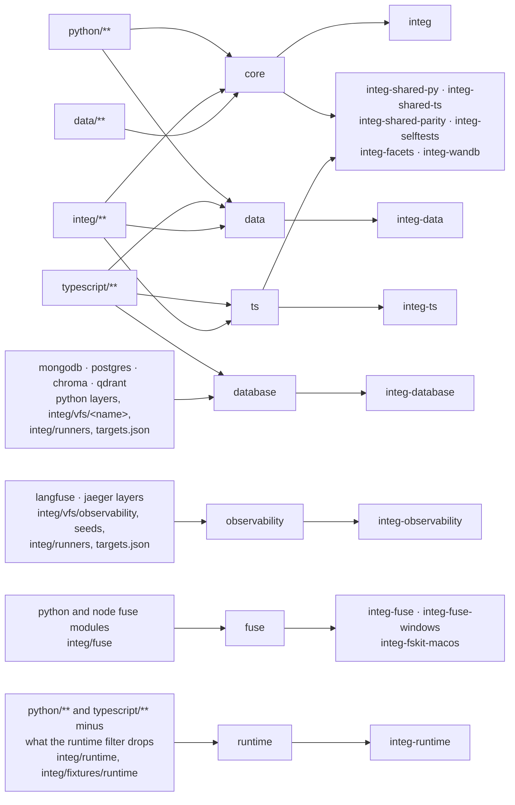

# integ

Cross-host integration tests: one declarative case corpus runs on the python
host and the typescript host against the same targets, so the two
implementations cannot drift apart.

## Pieces

- `runners/`: the battery. Every case is a shell line executed in a mirage
  workspace against a target's mounts; exit code, stdout and stderr are
  compared across hosts and against pinned goldens.
- `targets.json`: the targets, their mounts, and the env vars each service
  needs.
- `server/`: the fake services. The kit fakes (github, slack, box, dropbox,
  onedrive, gws, mail, gcs, ...) store per run in SQLite through `server/kit/`;
  `server/launcher/main.ts` hosts all of them in one process, one pinned port
  each from `ci/fakes.json`, and announces one `NAME_URL=...` line per arm.
  Some fakes carry a selftest (`pnpm run <name>:selftest`; the list is the
  `*:selftest` scripts in `package.json`); linear and trello have none, and
  the battery is what exercises them.
- `prisma/`: one schema per kit fake.
- `fixtures/`: the seed data cases assume.

## Runs and tenants

A run is an isolated world; a tenant is an account inside it. The runner mints
a fresh run id per target, so parallel batteries against one launcher never
collide.

- HTTP fakes carry the run as a `/_run/<id>/` path prefix, stripped before
  routing; the tenant comes from the credential.
- The mail fake speaks IMAP and SMTP, where no path exists: the username's
  local part is the tenant and the password is the run, so two runs log in at
  one address and see different mail.
- Kit storage is one SQLite file per run under a per-process temp root;
  `POST /reset` seeds or recreates one run.

For unmodified vendor clients that only accept a base URL and credential, opt
into credential routing on the fake process:

```sh
MIRAGE_RUN_TOKEN_PATTERN='^draw:(?<run>[^:]+):(?<tenant>[^:]+)$' \
  pnpm run notion:server
```

Seed with `POST /reset {"run":"a","tenants":["ws"],"fixture":"v1"}`,
then use `Authorization: Bearer draw:a:ws` with the ordinary vendor base URL.
The pattern's named `run` capture is required; `tenant` is optional and keeps
an account/namespace independent of its run. `Authorization: token ...` is
also accepted for run selection. Embedders can set `KitConfig.runTokenPattern`
instead of the environment variable. Without a matching pattern, existing
routing is unchanged. Precedence is path, run header, run query, credential;
explicit tenant headers/queries take precedence over the credential tenant.
Captured names use the same validation as explicit selectors.

GWS accepts the credential in the OAuth `refresh_token` form field and returns
it as the access token, so the subsequent bearer selects the same run. That
credential and the fixture's `gws-integ-token` are the only refresh tokens its
`/token` exchanges; any other gets Google's `400 invalid_grant`. The fixture
token also works as a bearer as it is. An API request with no credential is
refused with 403, and one whose bearer was never exchanged with 401. HF Hub
REST and MCP share run routing and request scheduling.

`DELETE /_kit/runs/<run>` waits for that run's requests, disconnects its client,
deletes its SQLite files and forgets its clocks, counters and remembered
fixture. It is idempotent; a later reset can reuse the name. Other runs are
unaffected. A bare reset remembers the last successful fixture **for that
run**; a new or deleted run starts from the process's `--fixture` choice.
`GET /_kit/health` reports `runs` as a count, never run identifiers.

Stores the fakes do not own are namespaced per run by the runner's adapters
and torn down after: S3 buckets `mirage-integ-<run>-...` (moto in-process by
default), a Mongo database `mirage_integ_<run>`, redis key prefixes, and temp
dirs for ssh.

## What a pull request runs

A push to main runs every job in `.github/workflows/test_integ.yml`. A pull
request runs only the jobs whose path filter matches a changed file; the
filters live in that workflow's `changes` job, and `typescript-build` runs
whenever a job that needs the built packages does.



The same wiring from the side of a change (`core` for a python file, `ts`
for a typescript file; a typescript file also sets `database`):

| Changed                                                                                                                                                                     | Filters set                                                                                                          |
| --------------------------------------------------------------------------------------------------------------------------------------------------------------------------- | -------------------------------------------------------------------------------------------------------------------- |
| shared code: shell, workspace, executor, generic commands (cat, ls, grep, ...), runtime, CLI, server, policy, cache; the ram, disk, s3, redis, mongodb, ssh backends        | core or ts, data, runtime                                                                                            |
| another backend's four layers (github, notion, gdrive, ...), an account CLI (gh, git, ntn, gws, ...), or jq, sed, awk, tar, gzip, zip, diff, cmp, sort, cut, rg, curl, wget | core or ts, data                                                                                                     |
| mongodb, postgres, chroma, qdrant                                                                                                                                           | core or ts, data, database (mongodb also runtime)                                                                    |
| langfuse, jaeger                                                                                                                                                            | core or ts, data, observability                                                                                      |
| `mirage/fuse/`, `node/src/fuse/`                                                                                                                                            | core or ts, data, fuse                                                                                               |
| python agent adapters, the browser, dsh and opencode packages, unit tests, markdown                                                                                         | core or ts, data                                                                                                     |
| `integ/runtime/`, `integ/fixtures/runtime/`                                                                                                                                 | core, ts, data, runtime                                                                                              |
| the rest of `integ/`: corpus, fakes, runners, goldens                                                                                                                       | core, ts, data (`runners/` and `targets.json` also database and observability; `package.json` also fuse and runtime) |
| `data/`                                                                                                                                                                     | core                                                                                                                 |
| `test_integ.yml`                                                                                                                                                            | every filter                                                                                                         |

The `runtime` filter is the only one that subtracts: it takes all of
`python/` and `typescript/` and drops what integ-runtime cannot reach, so a
new module runs the job until someone adds it to the drop list. Keep the
filters and this section in step with the code: a new or moved backend,
CLI or package belongs in the filter that tests it, and a runtime case that
starts mounting a dropped backend or calling a dropped command takes that
name off the drop list.

## Running locally

The `unix/cp` and `unix/mv` cases use GNU coreutils 9.7 as their transfer
reference (`debian:stable-slim`, `LC_ALL=C LANG=C TZ=UTC`). In particular,
`--update` accepts and advertises `all`, `none`, `none-fail`, and `older`;
the three-candidate diagnostic from 9.4 is no longer the reference.
The remeasurement used image
`debian@sha256:04634311a8d5fc442b6eb06d792293c4f3e2268652ca7634e00ce8ef5cc0a28a`.
One existing environment difference remains: for a missing exchange target,
this image reports `Unknown error -1`; the `mv_exchange_missing_side` golden
retains `No such file or directory`.

```bash
cd integ && npx tsx server/launcher/main.ts --config ci/fakes.json
# export the NAME_URL lines it prints, then:
./python/.venv/bin/python integ/runners/python/main.py --facet core --strict \
  --allow-skip chroma,lancedb,nextcloud,notion,postgres,qdrant
```

The core facet also needs redis and mongo on their default ports (CI uses a
`mongo:8` service container; `docker run -d -p 27017:27017 mongo:8` matches
it) and `MIRAGE_QUICKJS_HOME` pointing at the quickjs-ng WASI build for the
scripted target. If a pinned port is taken locally, copy `ci/fakes.json` and
move that one entry.
